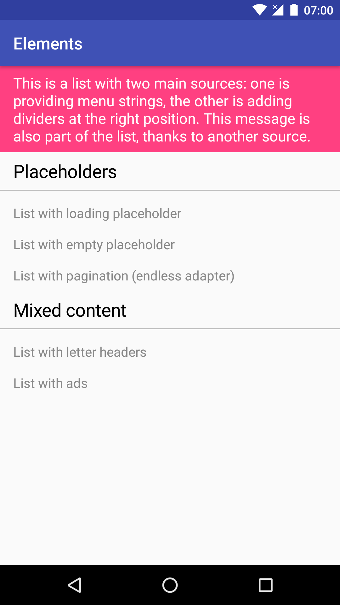
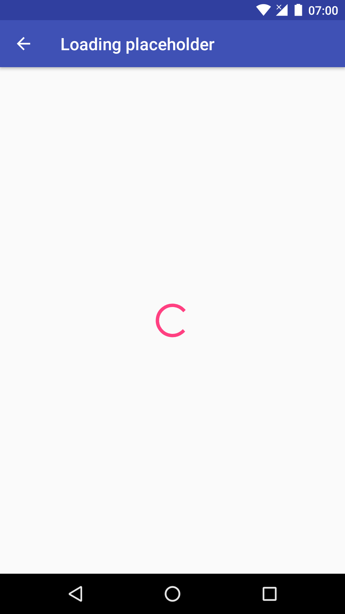
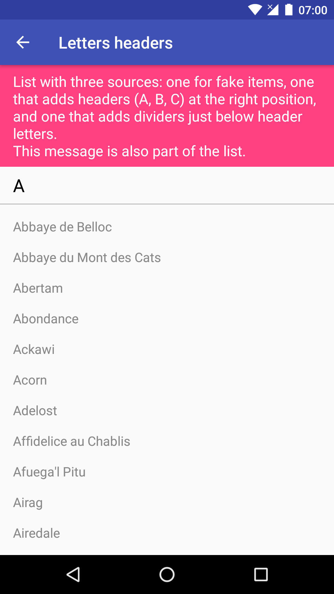
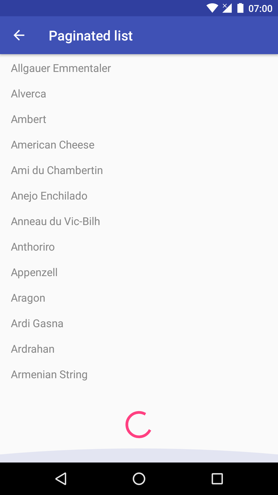

*This library is deprecated. Please take a look at https://github.com/natario1/Elements for a new, modern version, based on the Architecture components and written in Kotlin.*

<!-- markdown-preview README.md -->
<p align="center">
  
</p>

# Elements

```groovy
compile 'com.otaliastudios:elements:1.0.2'
```

A low-level library of reusable components for `RecyclerView`, with built-in awareness of / support for
pagination, state saving and restoration, asynchronous loading, dependencies and relative ordering of items.

At a higher level, Elements makes it easy to implement common patterns: "endless adapters",
placeholders for empty/loading lists, mixed content lists (headers, footers, sections, ads)
with dynamic animated items. Logic for loading, ordering and binding is split into separate components
that can be reused efficiently.

Take a look at the [sample](https://github.com/natario1/Elements/tree/master/sample) app for a showcase.



## Contributing

You are welcome to contribute with issues, PRs or suggestions. This is missing a few improvements
at the moment, and most urgently a test environment.

# Quickstart

Instantiate `ElementAdapter`, and simply set your `ElementSource` for data and your `ElementPresenter`
for presentation.

```java
// onCreate...
ElementAdapter adapter = new ElementAdapter();
adapter.setSource(new SimpleSource());
adapter.setPresenter(new SimplePresenter());
adapter.restoreState(savedInstanceState);
recyclerView.setAdapter(adapter);

// onSaveInstanceState
adapter.saveState(outState);
```

This is a simple implementation of `ElementSource` that provides strings:

```java
public class SimpleSource extends ElementSource {

  @Override protected Task<List<Object>> find(Pager.Page page) {
    return Task.callInBackground(new Callable<List<Object>>() {
      
      @Override
      public List<Object> call() throws Exception {
        // Running in a background thread...
        List<Object> list = new ArrayList<>();
        list.add("This is");
        list.add("a simple list");
        list.add("for page "+page.getPageNumber());
        return list; 
      }
    });
  }

  @Override protected boolean dependsOn(ElementSource other) {
    return false;
  }
  
  @Override protected ElementSerializer instantiateSerializer() {
    return new StringSerializer(); // For state restoration
  }
}
```

And this is a simple implementation of `ElementPresenter`:

```java
public class SimplePresenter extends ElementPresenter {

  @Override protected View onCreateView(ViewGroup parent, int elementType) {
    return new TextView(getContext()); // Or inflate a layout.
  }

  @Override protected void onBind(Pager.Page page, Holder holder, Element element) {
    super.onBind(page, holder, element);
    TextView textView = ((TextView) holder.getRoot());
    textView.setText((String) element.getData());
  }
}
```

The adapter will automatically load page 0 once it gets the `RecyclerView`.
That's enough to get you started. Keep reading to understand more about the concepts and how
this can be helpful in complex lists.

# In-depth docs

<!-- doctoc README.md --github --notitle -->
<!-- START doctoc generated TOC please keep comment here to allow auto update -->
<!-- DON'T EDIT THIS SECTION, INSTEAD RE-RUN doctoc TO UPDATE -->


- [Concepts](#concepts)
- [ElementAdapter](#elementadapter)
  - [Pages](#pages)
  - [Coordination](#coordination)
  - [Tasks](#tasks)
- [Element](#element)
- [ElementSource](#elementsource)
  - [Find behavior](#find-behavior)
  - [Ordering behavior](#ordering-behavior)
- [ElementPresenter](#elementpresenter)
  - [Binding process](#binding-process)
  - [State restoration](#state-restoration)
  - [Clicks](#clicks)
  - [Example presenter](#example-presenter)
- [ElementSerializer](#elementserializer)
- [BaseSource / BasePresenter](#basesource--basepresenter)
  - [Pagination placeholders](#pagination-placeholders)
  - [Empty placeholders](#empty-placeholders)
  - [Error placeholders](#error-placeholders)
  - [Loading placeholders](#loading-placeholders)

<!-- END doctoc generated TOC please keep comment here to allow auto update -->

## Concepts

Elements comes useful in complex apps that display lists with mixed content or particular ordering
/ fetching behavior. By providing simple component units, you won't be writing huge adapter classes
anymore (in fact, you don't extend `RecyclerView.Adapter` at all).

What you **will not** do:

- Extend `RecyclerView.Adapter`
- Extend `ViewHolder`
- Use `AsyncTask`s
- Use `notify*` methods
- Incapsulate loading, ordering, display and callbacks logic in a single adapter class
  or, worse, in the external container (e.g. fragment).
- Fetch data again on configuration changes

What you **will** do:

- Create one or more `ElementSource`s that fetch data asyncrhonously from your database
  and talk with each other if needed
- Create one or more `ElementPresenter`s that hold views and fill them with model data returned by
  sources
- Use (or create) a `ElementSerializer` to serialize your data during configuration changes

## ElementAdapter

`ElementAdapter` is `final`. All you should do is instantiate, set sources, set presenters, and
save / restore state when needed.

```java
// onCreate...
ElementAdapter adapter = new ElementAdapter();
adapter.setSource(...);
adapter.setPresenter(...);
adapter.restoreState(savedInstanceState);
recyclerView.setAdapter(adapter);

// onSaveInstanceState
adapter.saveState(outState);
```

The adapter cares about page management, coordination between components, and task management.

### Pages

The adapter will start to make you think in terms of smaller groups of items called pages, through
methods like `#getCurrentPage()`, `#loadSinglePage(int)` and so on.
This is convenient because you don't query the whole database, plus you can always work with 0-based
positions for each page.

You will usually load one page at a time starting at 0. When a page is requested,

- all the registered `ElementSource`s are asked for elements for that page
- all the registered `ElementSource` have a chance to define relative ordering policy
- elements are laid out by one (or more) `ElementPresenter` instance(s)

Elements can get their way into a page also through the `Pager.Page` object, that provides
utility methods (insert, remove, replace) that update the dataset and internally call notify* on the
adapter. **notify methods should never be called by you; it will likely break the internal state**.
Just use sources or a `Pager.Page` modification, that will provide animations as well.

### Coordination

Sources and presenters are designed to be reusable. A single adapter can have multiple source and
a single presenter, a single source and multiple presenters, or whatever you wish.
What matters is that every `Element` gets at least a `ElementPresenter` to be laid out.
The logic goes as follows:

- sources provide a list of objects for a certain page
- `int ElementSource#getElementType(Object)` is called to get an **element type** (kind of a view type in the ordinary recycler) for that object
- presenters register to deal with a certain element type through `List<Integer> ElementPresenter#getElementTypes()`

If no presenter is found for a certain type, an exception is thrown.

### Tasks

The library is built on top of Facebook's lightweight [bolts library](https://github.com/BoltsFramework/Bolts-Android).
`Task`s are entities similar to Javascript Promises, representing actions yet to be completed.
You will have to learn how to write a `Task` for your queries, but that is straightforward:

```java
return Task.callInBackground(new Callable<List<Object>>() {
  @Override
  public List<Object> call() {
    // This runs in a background thread.
    // Do sync stuff...
    return data;
  }
})
```
<!--
Or more generally,

```java
final TaskCompletionSource<List<Object>> tcs = new TaskCompletionSource<>();
// Do something async
database.setCallback(new Callback() {
  public void done(List<Object> data, Exception e) {
    if (e == null) {
      tcs.setResult(data);
    } else {
      tcs.setError(e);
    }
  }
});
database.query();
return tcs.getTask(); // Our task that will complete later.
``` -->

Each `ElementSource` will provide a task for fetching objects for a certain page of the list.
`ElementAdapter` tries to bundle these tasks together: they are executed concurrently by
default, but you can declare dependencies between sources such that, for example, one source task will
be run after the others have completed (e.g. for adding internal headers to a list).

## Element

An `Element` is the base block of the library. It can't be instantiated directly, but you will find
elements in various callbacks. Each element basically holds an `Object` representing data for that
item, and an `elementType` as returned by the source that originated that.

Elements should be created internally with the objects that your source finds, but if you really have
to create a new `Element` in a different time (e.g. to insert it to a `Pager.Page`), there are a few
ways to do so, namely `ElementAdapter#createElement()` and `Element#cloneWithData()`.

## ElementSource

`ElementSource` is the component that asynchronously fetches data to be modeled and later laid out by
`ElementPresenter`s. The key point about sources is that (**if needed**) they can declare relative
dependencies with each other, in a `CoordinatorLayout` fashion, through the `boolean dependsOn(other)` method.

This can be overriden to declare a dependency and has direct consequences explained below.

### Find behavior

When adapter is asked for a page, each source will go through different callbacks.

1. (if we declared some dependency) `onDependencyAfterFind(Pager.Page, ElementSource, Task)`:
   Notifies that a source we depend on has just finished its find task. At this point we are given
   the option to alter the other source results, before we find our own.
2. `onPrepareFind(Pager.Page, List)`: lets this source prepare the find call.
   If we declared some dependencies, `List` is passed with all the objects found by sources we depend on
   for this same page.
3. `Task<List<Object>> find(Pager.Page)`: this is abstract and must be filled. Asks this source for
   its elements, in a asynchronous action embedded in a `Task`.
4. `onAfterFind(Pager.Page, Task)`: called right after find. The passed task is completed and can be
   queried and altered with `Task#getResult()`. It is legit to alter our own results here.
   *After this ends, other sources that depend on this source will also be able to alter our results
   through their own `onDependencyAfterFind`.*
5. `onFindError(Pager.Page, Exception)`: notifies that, after the whole chain, an error was encountered.
   This makes it possible to provide replacement data (an error view, cached data...).

Implicitly, this means that declaring a dependency ensures that this source's find will be called
**after** the dependency find has finished. This can be very useful (think of header letters for a
alphabetically sorted list).

### Ordering behavior

The default behavior is that elements are added to the page in the order they come from the async tasks.
For instance, if there are two independent sources, their find methods will be called concurrently.
The one who completes first will have the objects added first to the recycler.

Things can get trickier if we declare some dependency: in that case, we have a chance to wait for other
sources elements to be laid out, and order our elements with a relative logic:

- `onPrepareOrder(Pager.Page, List, List)` let this source prepare the order call, based on the list
  of dependent sources elements that are already ordered
- `int orderBefore(Pager.Page, int, Element)` and similarly `orderAfter` let this source order 0+
  items right before / after the given dependency element

These callbacks will make you think in terms of an imaginary page made just of this source objects,
and this source's dependencies objects, with simple 0-based indexes. So if we want an `Ad` every 10
`Items`, just declare `AdSource` to be dependent on `ItemsSource` and implement one-line logic in
`orderBefore` or `orderAfter`.

```java
@Override
protected int orderBefore(Pager.Page page, int position, Element dependencyElement) {
  // Release an Ad every 10 items from the source we depend on
  return (position > 0 && position % 10 == 0) ? 1 : 0;
}
```

## ElementPresenter

`ElementPresenter` is the component that takes model data as returned by `ElementSource#find()`,
and binds data to actual views. In the ordinary `RecyclerView` world, a presenter holds the logic
for both view holder classes and onCreate / onBindViewHolder.

### Binding process

- `getElementTypes()` is called to understand which Elements should be bound by this presenter.
  For simple situations, the default can be used by both presenter and source similar method.
- `onCreateView(ViewGroup, int)` is called to inflate a view for the requested `elementType`.
  It is up to you whether to use the same view or different views.
- `onRegisterChildViews(int)` is called to create references to inner views that will be used later.
  This improves performance, so that later you can call `Holder#getView(id)` instead of expensive findViewByIds.
- `onInitialize(Holder)`: this is the point where you want to do operations that do not depend on
  input data (e.g. color filters to drawables). Think of this as `onCreateViewHolder` in the adapter.
- `onBind(Pager.Page, Holder, Element)`: performs actual binding.
  You can access page informations, holder views through `Holder#getView(id)`, and model data through
  `Element#getData()`.

### State restoration

This is meant to be a stateful component, to store external state such as selected / checked items in
a list. For this reason, `saveState(Bundle)` and `restoreState(Bundle)` callbacks are provided.

### Clicks

By default, presenter applies a click listener to the root view of each item, and you will receive
a call to `onElementClick(Pager.Page page, Holder holder, Element element)`. See
`ElementPresenter#setOnClickListener()` for info.

### Example presenter

```java
public class Presenter extends ElementPresenter {
  private int color;

  public Presenter(Context context, int color) {
    super(context);
    this.color = color;
  }

  @Override protected View onCreateView(ViewGroup parent, int elementType) {
    return new TextView(getContext()); // Or inflate a layout.
  }

  @Override protected void onInitialize(Holder holder) {
    TextView textView = ((TextView) holder.getRoot());
    textView.setTextColor(accentColor);
  }

  @Override protected void onBind(Pager.Page page, Holder holder, Element element) {
    super.onBind(page, holder, element);
    TextView textView = ((TextView) holder.getRoot());
    textView.setText((String) element.getData());
  }
}
```

## ElementSerializer

`ElementSerializer` is the component responsible of saving and restoring the dataset for a certain
page and a certain source. Depending on what data you are modeling, you can use one of the built in
serializers or create your own. The interface is simple:

```java
public interface ElementSerializer {

    void saveElements(Pager.Page page, ElementSource source, List<Object> elements, Bundle state);

    List<Object> restoreElements(Pager.Page page, ElementSource source, Bundle state);
}
```

The library provides `ParcelableSerializer` (recommended), `SerializableSerializer`,
`StringSerializer` and `StaticSerializer`. The static serializer should be your very last resource.

## BaseSource / BasePresenter

Elements provides two basic (still abstract) implementations called `BaseSource` and `BasePresenter`.
Together, they allow the display of some special placeholders. Each placeholder will have a layout
resource (override the defaults with `set*ViewRes()`) and private lifecycle callbacks if you need.

### Pagination placeholders

Special views that indicate the user that there is more content to be seen (a new page).
UI wise, this can be a progress bar or a button saying "Load more". The policy for pagination must
be implemented in your source. The most reasonable is:

- If you want to show 20 objects per page, ask the server for 21
- If 21 are returned, remove the last one and call `BaseSource#appendPaginationPlaceholder(List)`.

The source will care about inserting a special object with a special `elementType`.
`BasePresenter` will respond to this and provide default UI behavior.
You can customize the behavior and layout with `setPaginationMode()`:

- `PAGINATION_MODE_ONBIND`: new page is requested when the placeholder is bound, with a small delay.
- `PAGINATION_MODE_ONCLICK`: new page is requested when the placeholder is clicked.

### Empty placeholders

A special view that is shown when there's no content to be seen.
This works out of the box when, after loading page 0, the source returns no results.

### Error placeholders

A special view that is shown when the `Task` for objects has failed (e.g. an exception was thrown).
You can, for example, return a failed task when there is no connectivity, and show a network error.

### Loading placeholders

A spacial view that is shown *while* the `Task` for objects is going on, and removed when objects
are found. This is typically a Progress Bar.
